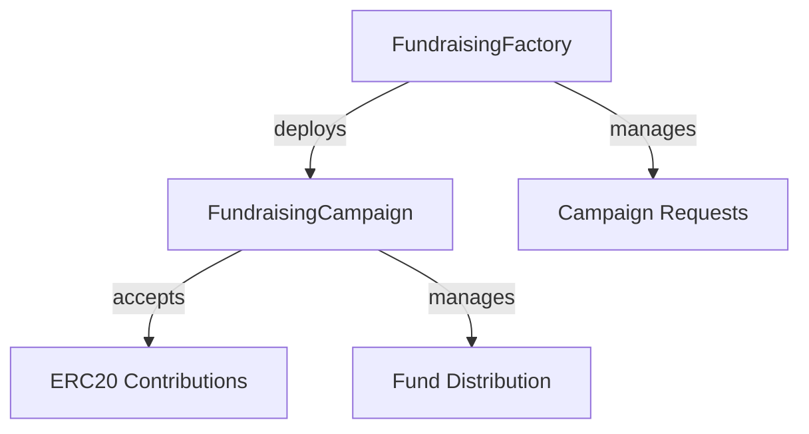
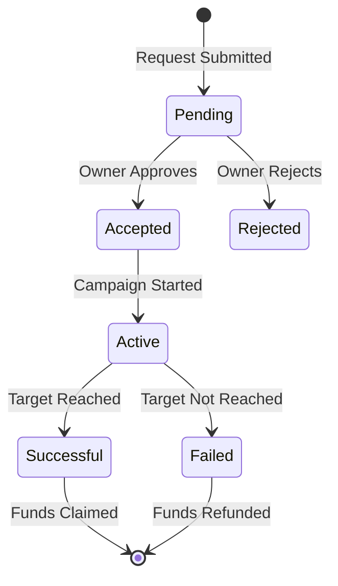

# Fundraising Smart Contract System

A decentralized fundraising platform allowing users to create and manage fundraising campaigns with ERC20 token contributions.

## Architecture

```
fundraising/
├── src/
│   ├── interface/
│   │   ├── IFundraisingCampaign.sol     # Campaign interface
│   │   └── IFundraisingFactory.sol      # Factory interface
│   ├── FundraisingFactory.sol           # Main factory contract
│   ├── FundraisingCampaign.sol          # Individual campaign contract
├── test/
│   ├─ mock/
│   │   └── MockERC20.sol                # Mock ERC20 for testing
│   ├── FundraisingFactory.t.sol         # Factory tests
│   └── FundraisingCampaign.t.sol        # Campaign tests
├── script/
│   ├── Deploy.s.sol                     # Deployment scripts
│   └── Interactions.s.sol               # Interaction scripts
└── lib/
    └── openzeppelin-contracts/          # Dependencies
```

## Features

### Factory Contract
- Campaign request submission
- Owner approval/rejection system
- Campaign deployment management
- Request status tracking
- Campaign registry

### Campaign Contract
- Multi-token contribution support
- Min/Max amount enforcement
- Timeline management
- Claim/Refund system
- Campaign status tracking

## Technical Stack

- Solidity 0.8.28
- Foundry Framework
- OpenZeppelin 5.x.x
  - Ownable
  - SafeERC20
  - ReentrancyGuard

## Test Coverage

```bash
| File                        | % Lines         | % Statements    | % Branches      | % Funcs        |
|-----------------------------|-----------------|-----------------|-----------------|----------------|
| src/FundraisingCampaign.sol | 100.00% (38/38) | 100.00% (42/42) | 100.00% (32/32) | 100.00% (5/5)  |
| src/FundraisingFactory.sol  | 100.00% (24/24) | 100.00% (24/24) | 100.00% (16/16) | 100.00% (5/5)  |
```

## Installation

1. Clone the repository
```bash
git clone https://github.com/Ronfflex/Fundraising.git
cd fundraising
```

2. Install dependencies
```bash
forge install
```

3. Build the project
```bash
forge build
```

## Testing

Run the complete test suite:
```bash
forge test
```

Run with verbosity:
```bash
forge test -vvv
```

Generate coverage report:
```bash
forge coverage --report lcov
```

## Deployment

1. Set up your environment variables in `.env`:
```env
PRIVATE_KEY=your_private_key
RPC_URL=your_rpc_url
ETHERSCAN_API_KEY=your_etherscan_api_key
```

2. Deploy the contracts:
```bash
forge script script/Deploy.s.sol --rpc-url $RPC_URL --broadcast --verify
```

## Contract Interactions

The project includes scripts for common interactions:

1. Create a new campaign:
```bash
forge script script/Interactions.s.sol:InteractionsScript --sig "createCampaign()" --rpc-url $RPC_URL --broadcast
```

2. Review a campaign:
```bash
forge script script/Interactions.s.sol:InteractionsScript --sig "reviewCampaign(uint256,bool)" <request_id> true --rpc-url $RPC_URL --broadcast
```

3. Contribute to a campaign:
```bash
forge script script/Interactions.s.sol:InteractionsScript --sig "contributeToCampaign(address,uint256,address)" <campaign_address> <amount> <token_address> --rpc-url $RPC_URL --broadcast
```

## Smart Contract Architecture

### Factory Pattern


### State Flow


## Security Features

1. **Access Control**
   - Ownable pattern for factory management
   - Creator-only access for campaign management

2. **Safety Measures**
   - ReentrancyGuard for all fund operations
   - SafeERC20 for token transfers
   - Checks-Effects-Interactions pattern

3. **Timeline Enforcement**
   - Start/End date validation
   - Status-based operation control

4. **Amount Controls**
   - Minimum/Maximum target validation
   - Contribution limit checks

## License

MIT